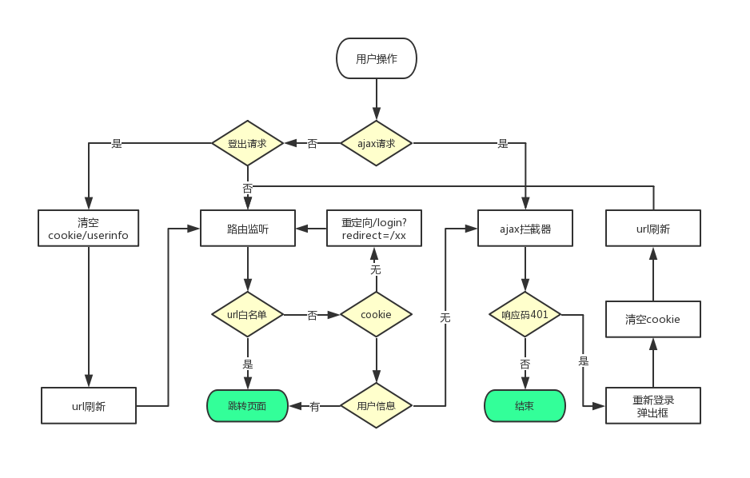
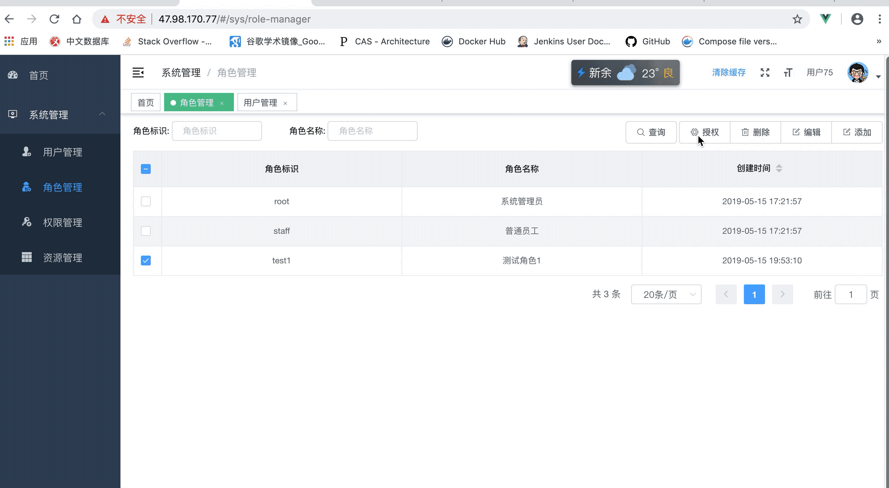
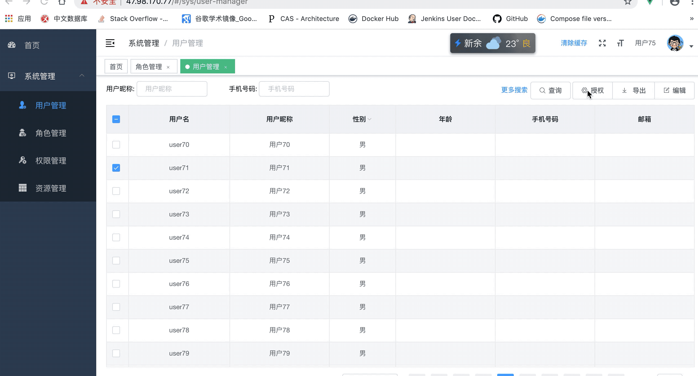

# 简介

upms是一个基于RBAC(Resource-Based Access Control)模型实现的按钮级别的细粒度权限管理系统。它是一个前后端分离的系统，用户可对角色进行动态配置：后台api接口权限 + 前端目录/按钮/表格等元素的显示和隐藏。

## upms-front

upms-front是upms系统的前端实现，基于vue-element-admin的二次开发，去除了所有无关页面，对部分功能做了修改，如：多层级的侧边栏 + 前端权限验证流程。

## 系统功能

1. 用户注册/登录/登出
2. 资源管理
	- 资源树以树的形式管理
	- 非叶子节点代表目录、叶子节点代表一个页面拥有的元素，包括表格、按钮等
	- 每个叶子节点可与多个后台api接口权限关联
3. 角色管理
	- CRUD
	- 角色授权
	
4. 用户管理
	- CRUD
	- 用户授权
	- 用户Excel导出
  
5. 权限管理
	- CRUD
	- 权限Excel导出

## 登录处理流程图

## 授权截图

### 角色授权

### 用户授权

### 重新登录

## 在线体验

提示：

1. 本系统登录为单用户登陆，如正常操作时提示登录异常，一般是有其他人登录了该账户，请用其他账户体验。
2. 用户名为user11 ~ user199 密码都是 123456，用户名user后面的数字奇数为管理员，偶数为普通用户。
3. 为了不影响他人体验，最好自己新增角色，然后对该角色授权。

演示地址：[http://47.98.170.77](http://47.98.170.77?_blank)

## 待解决问题

1. 角色授权弹窗框里的穿梭框，在它的底部添加了自动授权按钮后，会遮挡列表元素。
2. 后台返回业务校验错误信息时，不要element ui的弹出框显示，而是通过async-validate来显示错误信息
3. 授权页面与资源管理页面的没有处理样式

## 推广

Hi拼购，云主机低至199元/年<a href="https://www.aliyun.com/acts/hi-group-buying?userCode=fdg6btmo">https://promotion.aliyun.com/ntms/act/enterprise-discount.html?userCode=fdg6btmo</a>
